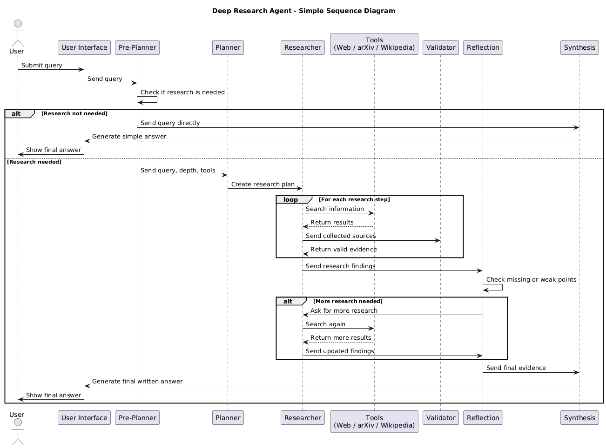
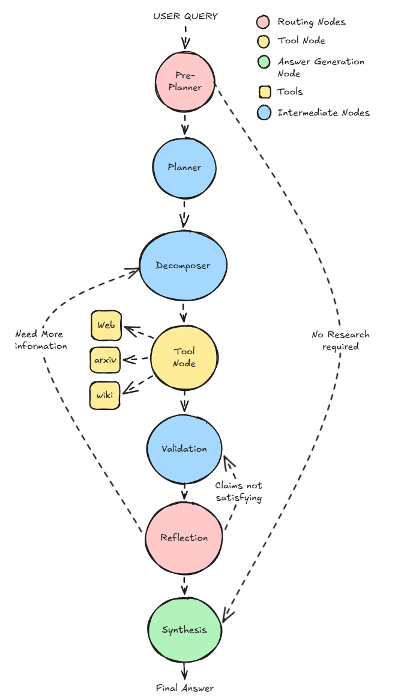
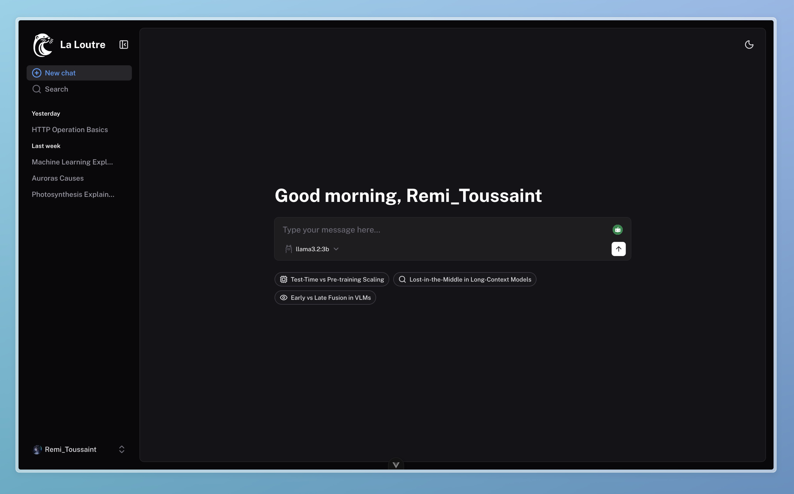
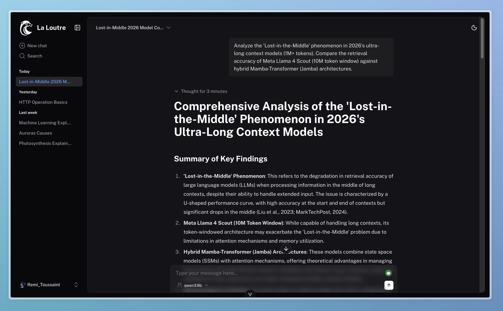

# Deep Research Agent

An Agentic AI-based deep research assistant that performs planning, decomposition, retrieval, validation, reflection, and synthesis to generate structured and citation-backed research responses. The system is built using LangGraph, LangChain, Ollama, FastAPI, and a Vue-based frontend. 

---

## Abstract

Traditional Large Language Models (LLMs) often struggle with deep research tasks due to hallucinations, lack of citations, shallow reasoning, and limited self-correction abilities.
This project introduces a **Deep Research Agent** that transforms research into a structured multi-stage workflow using Agentic AI principles.

The system performs:

* Research planning
* Task decomposition
* Tool-based information retrieval
* Source validation
* Reflection and iterative improvement
* Final synthesis with citations

The architecture is implemented using **LangGraph**, **LangChain**, **Ollama**, and **FastAPI**, with a frontend interface that streams intermediate reasoning steps in real time. 

---

## Architecture

### Sequence Diagram



### Deep Research Agent Workflow



---

## Features

* Multi-step research workflow
* Query decomposition
* Web, Wikipedia, and scientific search integration
* Source validation with confidence scoring
* Reflection-based iterative research
* Streaming intermediate reasoning steps
* Langfuse tracing and observability
* Local LLM execution using Ollama

---

## Tech Stack

### Backend

* Python
* FastAPI
* LangChain
* LangGraph
* Ollama
* Langfuse

### Frontend

* Vue 3
* Vite
* TailwindCSS
* Nuxt UI

---

## Project Structure

```bash
.
├── backend/
├── frontend/
└── README.md
```

The backend and frontend setup instructions are available inside their respective folders.

---

## Workflow

```text
User Query
   ↓
Pre-Planner
   ↓
Planner
   ↓
Decomposer <------
   ↓             |
Tool Nodes       |
   ↓             |
Validation <-    |
   ↓        |    |
Reflection--------
   ↓
Synthesis
   ↓
Final Answer
```

---

## Frontend Preview

### Home Page



### Research Session


### Final Response




---

## Authors

* Vishnu Vardhan Addanki Tirumala
* Rémi Wysocka
* Mary Asha Reddy Boreddy

---

## Reference

Project report and architecture details are available in the documentation. 
